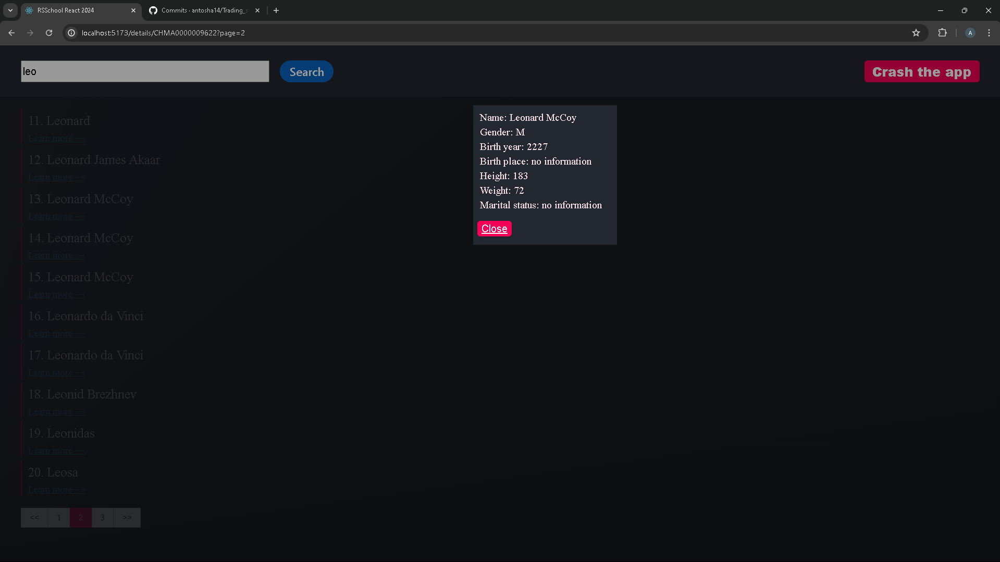

1. Task: https://github.com/rolling-scopes-school/tasks/blob/master/react/modules/tasks/routing.md
2. Screenshot:
   
3. Deployment: https://rsschoolreact2024.netlify.app/
4. Done ?? / deadline 15.07.2024
5. Score: 100 / 100

- [x] Tests are added to the project, can be run via a test command in the package.json, no errors are produced, test coverage >= 80% (at least for statements) (30/30)
- [x] Conversion of class components to functional components with hooks (15/15)
- [x] Custom hook to restore search query from LS and put it back to LS on unmount (5/5)
- [x] Pagination is present in both URL and on the page (20/20)
- [x] Upon clicking, open details panel on the right side of the page (5/5)
- [x] use router outlet, left side of the page should continue displaying the list of results (10/10)
- [x] initiate an additional API call, display a loader, and update the URL (5/5)
- [x] Details panel should be closed either on the "close" button click or on the main panel click (10/10)

refactor: rewrite whole app using functional components, fix: form input event type

Modal

import { useEffect, useRef } from 'react';

export default function ModalDialog({ isOpen, children }) {
const ref = useRef();

useEffect(() => {
if (!isOpen) {
return;
}
const dialog = ref.current;
dialog.showModal();
return () => {
dialog.close();
};
}, [isOpen]);

return <dialog ref={ref}>{children}</dialog>;
}

App

import { useState } from 'react';
import ModalDialog from './ModalDialog.js';

export default function App() {
const [show, setShow] = useState(false);
return (
<>
<button onClick={() => setShow(true)}>
Open dialog
</button>
<ModalDialog isOpen={show}>
Hello there!
 
<button onClick={() => {
setShow(false);
}}>Close</button>
</ModalDialog>
</>
);
}

1. Определить роуты через специальную функцию (объекты в ней, c path and element)
2. Обернуть приложение в RouterProvider <RouterProvider router={router}></RouterProvider>
3. Ходим от страницы к странице с помощью Link
4. useNavigation для новигации в коде
5. retlative={path} prop на линке чтобы релатив кидал по текущей ссылке, а не по path definitions

npm install jest --save-dev
npm install @testing-library/react --save-dev
npm install ts-jest @types/jest --save-dev
Run npm install ts-node @testing-library/jest-dom --save-dev
Run npm install jest-environment-jsdom
Run npm install identity-obj-proxy --save-dev
In your root directory, create a jest.config.ts file
https://www.youtube.com/watch?v=G-4zgIPsjkU

